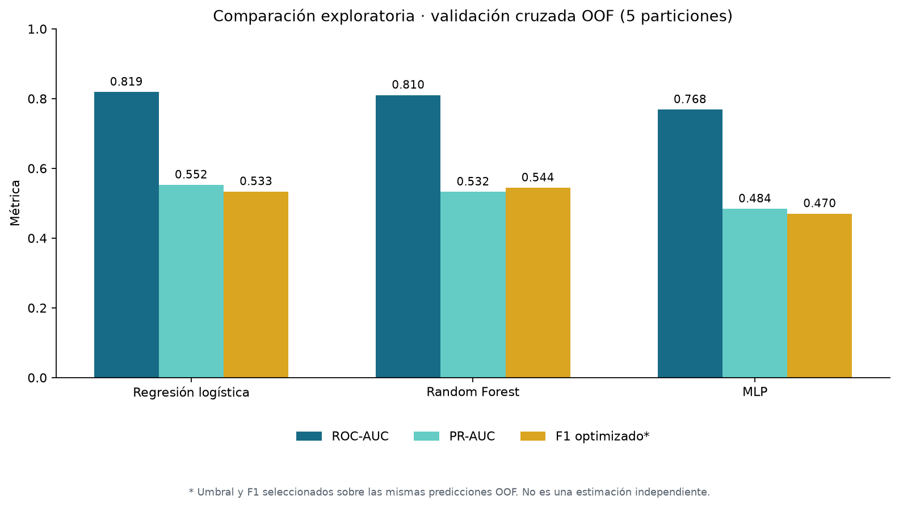

# Predicción de rotación de empleados

Proyecto educativo de Big Data y analítica de Recursos Humanos. Integra preparación de datos con PySpark, modelado con scikit-learn, persistencia en PostgreSQL y visualización en Power BI.

> **Uso educativo:** los datos y resultados son demostrativos. No están validados para evaluar, seleccionar, retener ni gestionar personas.

## Alcance

- Control de calidad e integración de dos ficheros mediante ETL con PySpark.
- Comparación de Regresión Logística, Random Forest y MLP.
- Evaluación con validación cruzada anidada y selección de umbral sin contaminar el fold externo.
- Persistencia de características y predicciones en PostgreSQL.
- Visualización ejecutiva y análisis de prioridades en Power BI.

**Tecnologías:** Python, PySpark, scikit-learn, Jupyter, Docker Compose, PostgreSQL y Power BI.

## Entregables

- [Panel de Power BI](bi/Panel_Rotacion_Empleados.pbix)
- [Presentación del proyecto](docs/Presentacion_Proyecto_Rotacion.pptx)
- [Memoria del proyecto (PDF)](docs/Memoria_Proyecto_Beatriz.pdf) · [versión HTML](docs/Memoria_Proyecto_Beatriz.html)
- Notebooks de análisis y documentación en `notebooks/`
- [Arquitectura](docs/arquitectura.md)
- [Procedencia de datos](docs/DATA_SOURCE.md)
- [Protocolo de modelado](docs/MODELING_PROTOCOL.md)

## Datos

El dataset principal contiene 1.470 registros y 35 variables del ejercicio de rotación. La procedencia y las limitaciones están documentadas en `docs/DATA_SOURCE.md`.

`encuesta_clima.csv` es completamente sintético: se genera con semilla 42 y cinco escalas aleatorias de 1 a 5. No son respuestas reales ni una medición observada de clima.

## Pipeline canónico

La única ruta oficial para obtener las métricas y artefactos finales es:

```bash
docker compose up -d --build

docker compose run --rm jupyter python /scripts/generate_synthetic_survey.py \
  --input /data/raw/WA_Fn-UseC_-HR-Employee-Attrition.csv \
  --output /data/raw/encuesta_clima.csv --seed 42

docker compose run --rm jupyter python /scripts/check_data_quality.py \
  --input1 /data/raw/WA_Fn-UseC_-HR-Employee-Attrition.csv \
  --input2 /data/raw/encuesta_clima.csv \
  --key EmployeeNumber --max-null-frac 0.25

docker compose run --rm jupyter python /scripts/etl_attrition.py \
  --input1 /data/raw/WA_Fn-UseC_-HR-Employee-Attrition.csv \
  --input2 /data/raw/encuesta_clima.csv \
  --outdir /data/processed/employee_attrition.parquet

docker compose run --rm jupyter python /scripts/train_ml.py \
  --input /data/processed/employee_attrition.parquet --model all

docker compose run --rm jupyter python /scripts/render_dashboard_previews.py
```

La evaluación usa 5 folds externos y 3 folds internos para seleccionar el umbral. Las variables `survey_*` son sintéticas y se excluyen del entrenamiento; su finalidad es demostrar integración de fuentes. Las métricas finales se generan de nuevo con `scripts/train_ml.py`; no se deben copiar como definitivos los valores históricos de versiones anteriores.

## PostgreSQL

El esquema reproducible está en `postgres/init/001_schema.sql`. Las credenciales y puertos se pueden configurar mediante `.env`, usando `.env.example` como plantilla.

Para persistir resultados:

```bash
docker compose run --rm jupyter python /scripts/load_features_to_pg.py \
  --input /data/processed/employee_attrition.parquet

docker compose run --rm jupyter python /scripts/persist_results.py \
  --input /data/processed/employee_attrition.parquet \
  --model /output/models/logreg_pipeline.pkl \
  --model_name LogReg \
  --metrics_json /output/metrics/model_compare.json
```

## Notebooks

Para regenerar sus HTML desde cero: `bash scripts/export_notebooks.sh`.

Los notebooks explican el análisis y sirven como material educativo. `02_Modelado_Baseline` y `03_Modelado_DL` mantienen sus comparativas exploratorias separadas y no deben sobrescribir la comparativa canónica.

## Dashboard



Las figuras de `docs/powerbi/` son vistas estáticas generadas a partir de los artefactos del pipeline. El PBIX es el entregable interactivo y debe abrirse en Power BI Desktop para comprobar filtros, relaciones e interacciones.

## Reproducibilidad y calidad

- Dependencias Python fijadas en `requirements-ml.txt`.
- Versiones de Docker fijadas a tags concretos.
- Healthcheck de PostgreSQL antes de arrancar Jupyter.
- Tests unitarios en `tests/`.
- CI en `.github/workflows/ci.yml`.
- Salidas generables en `output/metrics`, `output/models`, `output/plots` y `output/bi`.

## Uso responsable

El proyecto es formativo. Los coeficientes y asociaciones no son efectos causales, y el rendimiento en este conjunto no se puede trasladar a una plantilla real. No deben introducirse datos personales, confidenciales o de empleados reales.
