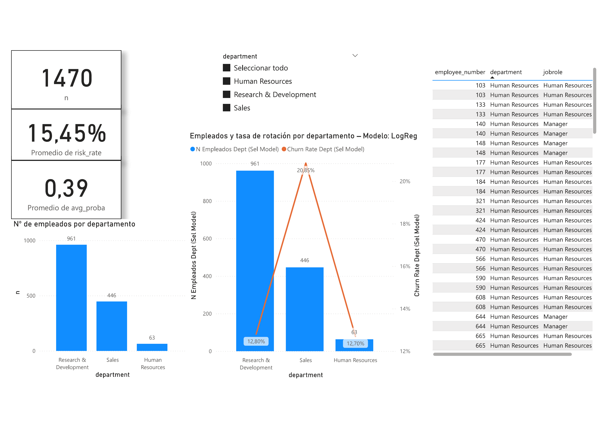

# Proyecto Big Data — Predicción de Rotación de Empleados (Spark + ML)

Arquitectura reproducible con Docker (Jupyter + Spark), ETL en PySpark y modelos (LogReg, Random Forest, MLP).  
Incluye KPIs de negocio y notebook de informe final.

## Cómo ejecutar
1. `docker compose up -d`
2. Abre Jupyter: `http://localhost:8889/lab?token=beatriz`
3. Ejecuta notebooks en `notebooks/` en orden: `01_EDA_Attrition`, `02_Modelado_Baseline`, `03_Modelado_DL`, `05_Dashboard_KPIs`, `99_Informe_Final`.
4. Resultados en `output/metrics`, `output/models`, `output/plots`, `output/bi`.

## Estructura
- `data/raw/` CSV originales
- `data/processed/` Parquet (ignorado en git)
- `scripts/` ETL PySpark
- `notebooks/` análisis, modelos, KPIs, informe
- `output/` métricas/modelos/plots (ignorado en git)
- `docker-compose.yml` entorno reproducible

## Dashboard — Proyecto Beatriz (Power BI)
- **Proyecto Beatriz (PBIX):** [`bi/Proyecto_Beatriz.pbix`](bi/Proyecto_Beatriz.pbix)

## Notebooks (HTML)
- [01 — EDA](docs/01_EDA_Attrition.html)
- [02 — Modelado baseline](docs/02_Modelado_Baseline.html)
- [05 — Dashboard & KPIs](docs/05_Dashboard_KPIs.html)

## Memoria del proyecto

- **PDF**: [Memoria del Proyecto (PDF)](docs/Memoria_Proyecto_Beatriz.pdf)


## Reproducir (rápido)
```bash
docker compose up -d
docker compose run --rm jupyter python /scripts/preprocess.py \
  --input /data/processed/employee_attrition.parquet \
  --out /output/models/transformer.joblib
docker compose run --rm jupyter python /scripts/train_ml.py \
  --input /data/processed/employee_attrition.parquet --model logreg
docker compose run --rm jupyter python /scripts/train_ml.py \
  --input /data/processed/employee_attrition.parquet --model rf

## Memoria del proyecto
- PDF: [docs/Memoria_Proyecto_Beatriz.pdf](docs/Memoria_Proyecto_Beatriz.pdf)

### Entregables
- PBIX final: `bi/Proyecto_Beatriz.pbix`
- Memoria del proyecto (PDF): `docs/Memoria_Proyecto_Beatriz.pdf`
- Notebooks para lectura rápida (HTML) en `/docs`
- Modelos y métricas en `/output`
- Tag de entrega: `v1.0-entrega`

## Capturas del Dashboard — Proyecto Beatriz

1. **Resumen KPIs**  
   

2. **Segmentos — Distribución de probabilidades**  
   

3. **Departamentos — Tasa de rotación**  
   

4. **Puestos & Horas extra — Riesgo**  
   

5. **Drivers — Principales factores**  
   
